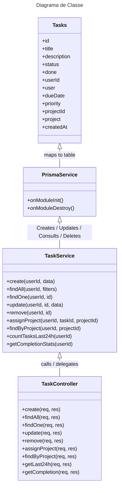

```mermaid
---
title: Diagrama de Classe
---
classDiagram
    TaskService <|-- TaskController : calls / delegates
    PrismaService <|-- TaskService : Creates / Updates / Consults / Deletes
    Tasks <|-- PrismaService : maps to table
    class TaskController {
        +create(req, res)
        +findAll(req, res)
        +findOne(req, res)
        +update(req, res)
        +remove(req, res)
        +assignProject(req, res)
        +findByProject(req, res)
        +getLast24h(req, res)
        +getCompletion(req, res)
    }
    class TaskService {
        +create(userId, data)
        +findAll(userId, filters)
        +findOne(userId, id)
        +update(userId, id, data)
        +remove(userId, id)
        +assignProject(userId, taskId, projectId)
        +findByProject(userId, projectId)
        +countTasksLast24h(userId)
        +getCompletionStats(userId)
    }
    class PrismaService {
        +onModuleInit()
        +onModuleDestroy()
    }
    class Tasks {
        +id 
        +title 
        +description
        +status 
        +done 
        +userId 
        +user 
        +dueDate 
        +priority 
        +projectId
        +project
        +createdAt
    }   
```