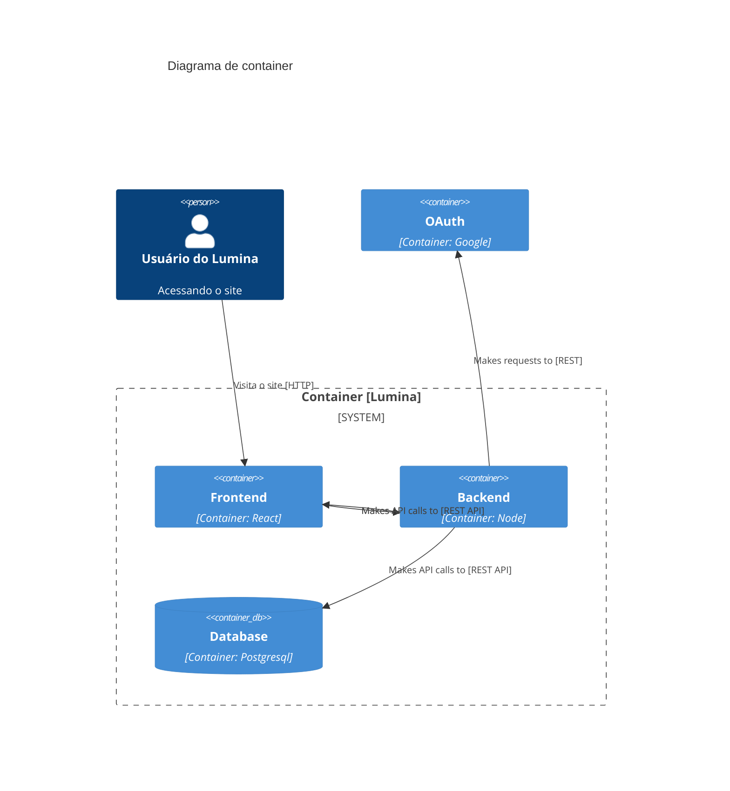

```mermaid
C4Container
title Diagrama de container

Person(user, "Usuário do Lumina", "Acessando o site")

System_Boundary(lumina, "Container [Lumina]") {
    Container(frontend, "Frontend", "Container: React")
    Container(backend, "Backend", "Container: Node")
    ContainerDb(database, "Database", "Container: Postgresql")
}

Container(oauth, "OAuth", "Container: Google")

Rel(user, frontend, "Visita o site [HTTP]")
Rel(frontend, backend, "Makes API calls to [REST API]")
Rel(backend, frontend, "Makes API calls to [REST API]")
Rel(backend, database, "Makes API calls to [REST API]")
Rel(backend, oauth, "Makes requests to [REST]")
```