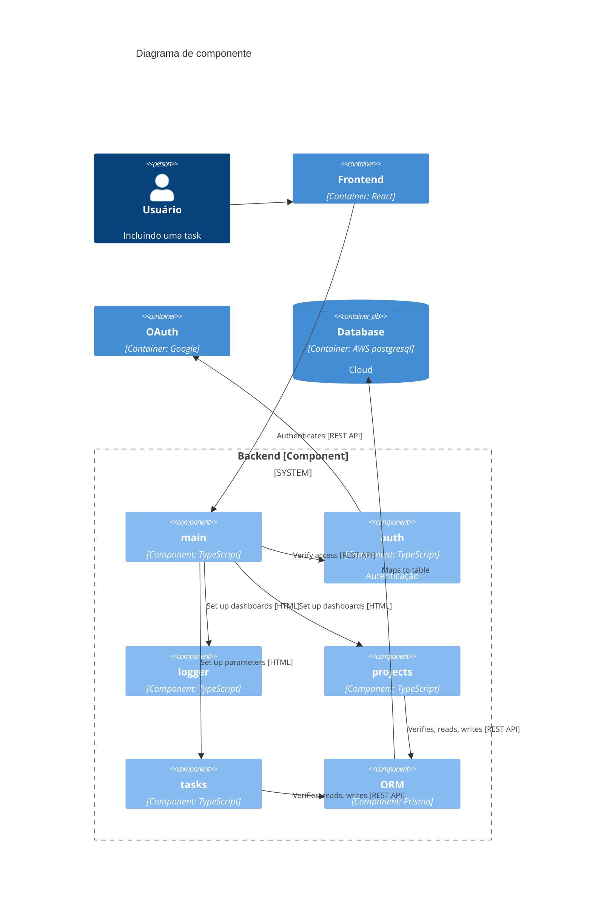

```mermaid
C4Component
title Diagrama de componente

Person(usuario, "Usuário", "Incluindo uma task")

Container(frontend, "Frontend", "Container: React")

System_Boundary(backend, "Backend [Component]") {
    Component(main, "main", "Component: TypeScript")
    Component(auth, "auth", "Component: TypeScript", "Autenticação")
    Component(logger, "logger", "Component: TypeScript")
    Component(projects, "projects", "Component: TypeScript")
    Component(tasks, "tasks", "Component: TypeScript")
    Component(orm, "ORM", "Component: Prisma")
}

Container(oauth, "OAuth", "Container: Google")
ContainerDb(database, "Database", "Container: AWS postgresql", "Cloud")

Rel(usuario, frontend, "")
Rel(frontend, main, "")
Rel(main, auth, "Verify access [REST API]")
Rel(auth, oauth, "Authenticates [REST API]")

Rel(main, logger, "Set up dashboards [HTML]")
Rel(main, projects, "Set up dashboards [HTML]")
Rel(main, tasks, "Set up parameters [HTML]")

Rel(projects, orm, "Verifies, reads, writes [REST API]")
Rel(tasks, orm, "Verifies, reads, writes [REST API]")

Rel(orm, database, "Maps to table")
```