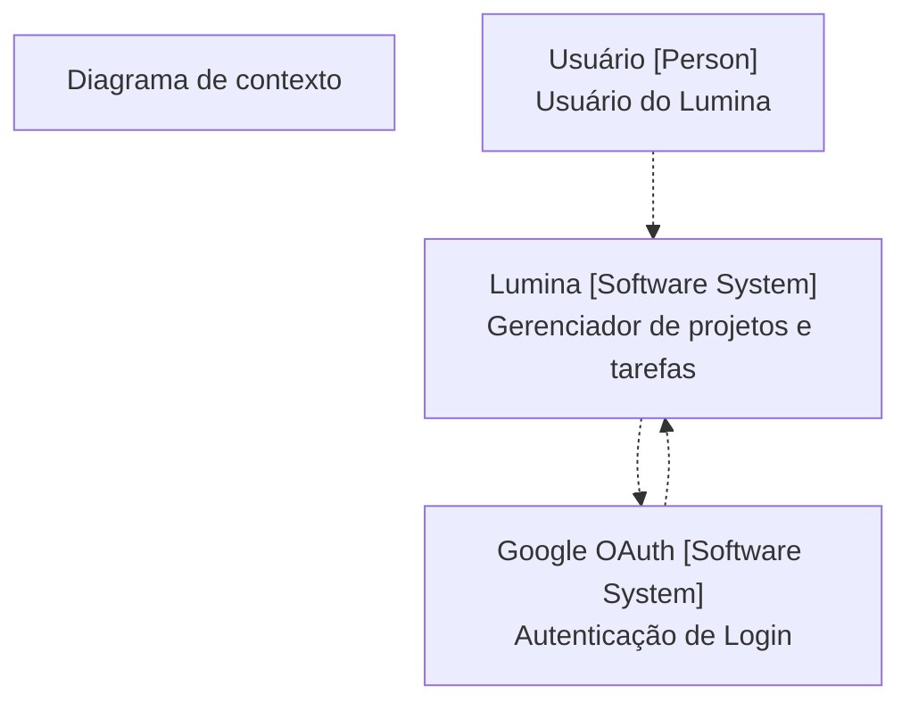

```mermaid
flowchart TD
    D["Diagrama de contexto"]
    A["Usuário [Person]\nUsuário do Lumina"]
    B["Lumina [Software System]\nGerenciador de projetos e tarefas"]
    C["Google OAuth [Software System]\nAutenticação de Login"]

    A -.-> B
    B -.-> C
    C -.-> B
```