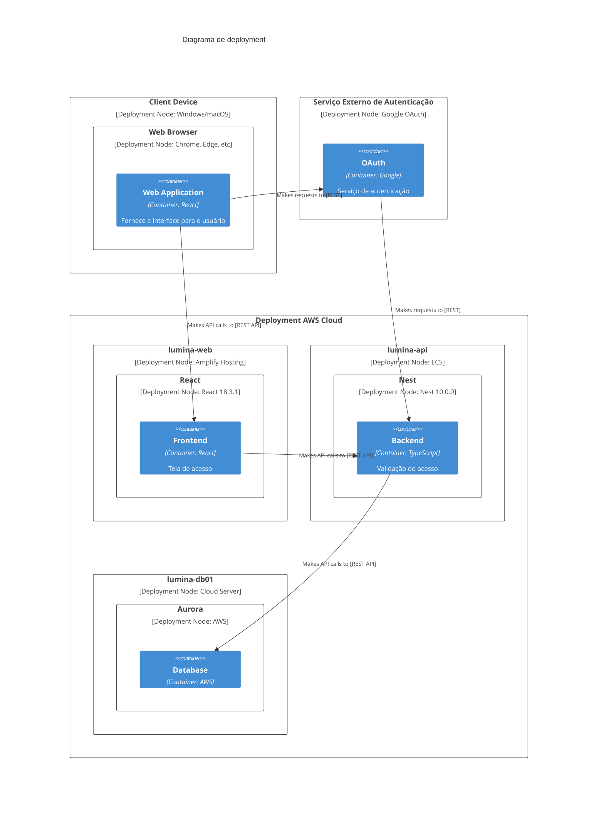

```mermaid
C4Deployment
title Diagrama de deployment

Deployment_Node(client_device, "Client Device", "Deployment Node: Windows/macOS") {
    Deployment_Node(web_browser, "Web Browser", "Deployment Node: Chrome, Edge, etc") {
        Container(web_app, "Web Application", "Container: React", "Fornece a interface para o usuário")
    }
}

Deployment_Node(oauth_node, "Serviço Externo de Autenticação", "Deployment Node: Google OAuth") {
    Container(oauth, "OAuth", "Container: Google", "Serviço de autenticação")
}

Deployment_Node(aws_cloud, "Deployment AWS Cloud", "") {

    Deployment_Node(lumina_web, "lumina-web", "Deployment Node: Amplify Hosting") {
        Deployment_Node(react_node, "React", "Deployment Node: React 18.3.1") {
            Container(frontend, "Frontend", "Container: React", "Tela de acesso")
        }
    }

    Deployment_Node(lumina_api, "lumina-api", "Deployment Node: ECS") {
        Deployment_Node(nest_node, "Nest", "Deployment Node: Nest 10.0.0") {
            Container(backend, "Backend", "Container: TypeScript", "Validação do acesso")
        }
    }

    Deployment_Node(lumina_db, "lumina-db01", "Deployment Node: Cloud Server") {
        Deployment_Node(aurora_node, "Aurora", "Deployment Node: AWS") {
            Container(database, "Database", "Container: AWS", "")
        }
    }
}

Rel(web_app, frontend, "Makes API calls to [REST API]")
Rel(frontend, backend, "Makes API calls to [REST API]")
Rel(backend, database, "Makes API calls to [REST API]")
Rel(web_app, oauth, "Makes requests to [REST]")
Rel(oauth, backend, "Makes requests to [REST]")
```